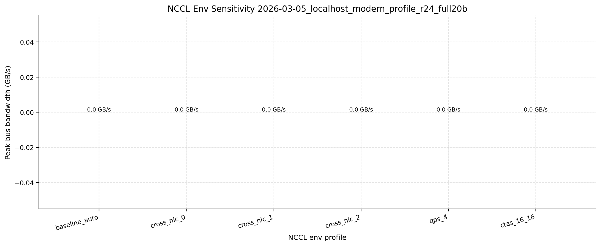
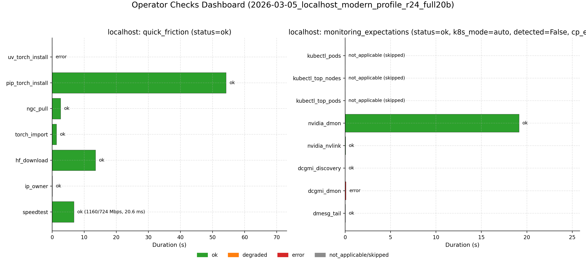
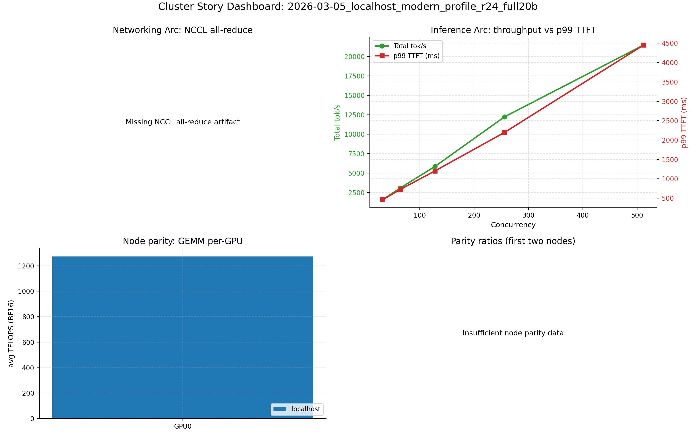
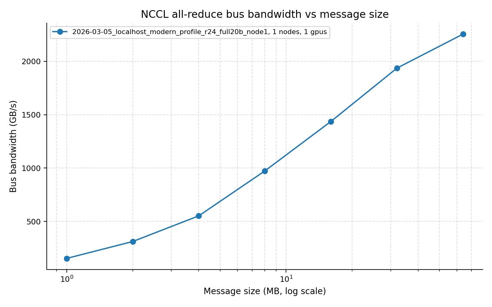
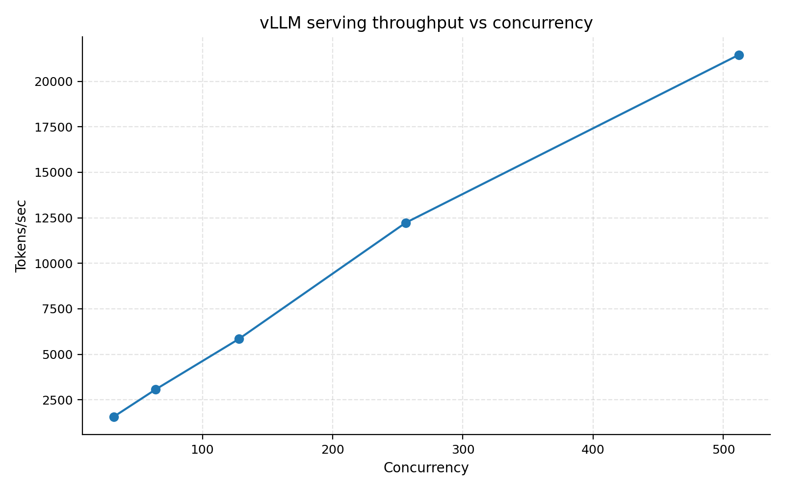
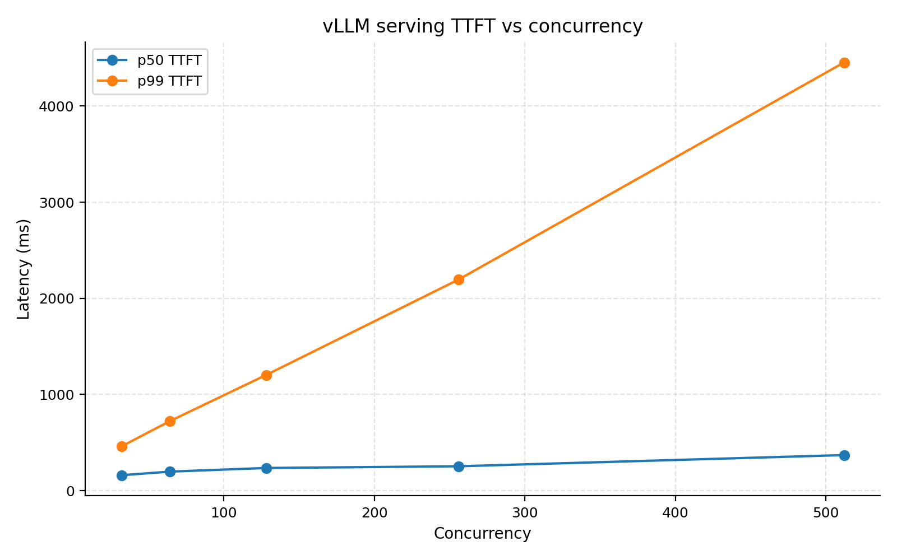

# Cluster Perf Field Report (Localhost, 1 Node)

Last updated: 2026-03-06. Canonical run: `2026-03-05_localhost_modern_profile_r24_full20b`.

## Table of Contents
1. [TL;DR](#tldr)
2. [Scope + Canonical Artifacts](#scope--canonical-artifacts)
3. [Required Reliability Gates (Canonical Run)](#required-reliability-gates-canonical-run)
4. [Operator Friction + Monitoring Expectations (New Checks)](#operator-friction--monitoring-expectations-new-checks)
5. [Cluster Story (First Contact)](#cluster-story-first-contact)
6. [Weird / New / Interesting (with Normal Baseline)](#weird--new--interesting-with-normal-baseline)
7. [Benchmark A (Networking Story)](#benchmark-a-networking-story)
8. [Benchmark B (Inference Story)](#benchmark-b-inference-story)
9. [Required Issues (Explicit)](#required-issues-explicit)
10. [Root Cause + Fix Mapping](#root-cause--fix-mapping)
11. [Report Completeness Delta (vs prior condensed revision)](#report-completeness-delta-vs-prior-condensed-revision)
12. [Gaps, Risks, and Smell Checks](#gaps-risks-and-smell-checks)
13. [Implications for Small AI Teams](#implications-for-small-ai-teams)
14. [Stakeholder Recommendations (Prioritized)](#stakeholder-recommendations-prioritized)
15. [Repro Steps](#repro-steps)
16. [Reproducibility Package](#reproducibility-package)
17. [Appendix (Coverage vs Case-Study Goals)](#appendix-coverage-vs-case-study-goals)
18. [Activity Log](#activity-log)

## TL;DR
| Topic | Summary |
| --- | --- |
| Scope | `localhost` only, 1 GPU(s) |
| Canonical run | `2026-03-05_localhost_modern_profile_r24_full20b` |
| Suite status | `48/71` steps green; `validate_required_artifacts=1` |
| Networking headline | NCCL single-node peak algbw `2255.5 GB/s` (67108864 bytes); connectivity probe `131.514 GB/s` payload algbw |
| Inference headline | vLLM total throughput `1572.544 tok/s` (c=32) -> `21456.795 tok/s` (c=512); p99 TTFT `460.532 ms` -> `4453.392 ms` |
| Operator checks | quick_friction `ok` (pass=6, failed=1, expected=1, unexpected=0), monitoring_expectations `ok` |
| Key weird/new | Single-node NCCL env sweep can show `busbw=0.0` by definition (rank=1), while algbw is still strong. |

## Scope + Canonical Artifacts
| Item | Value |
| --- | --- |
| Hosts in-scope | `localhost` |
| Excluded hosts | none |
| GPUs per host | `1` |
| Canonical manifest | [published/current/manifest.json](published/current/manifest.json) |
| Canonical suite steps | [published/current/structured/2026-03-05_localhost_modern_profile_r24_full20b_suite_steps.json](published/current/structured/2026-03-05_localhost_modern_profile_r24_full20b_suite_steps.json) |
| Meta snapshot | [published/current/structured/2026-03-05_localhost_modern_profile_r24_full20b_localhost_meta.json](published/current/structured/2026-03-05_localhost_modern_profile_r24_full20b_localhost_meta.json) |
| Node parity summary | [published/current/structured/2026-03-05_localhost_modern_profile_r24_full20b_node_parity_summary.json](published/current/structured/2026-03-05_localhost_modern_profile_r24_full20b_node_parity_summary.json) |
| Operator checks dashboard | [published/current/structured/2026-03-05_localhost_modern_profile_r24_full20b_operator_checks_dashboard.json](published/current/structured/2026-03-05_localhost_modern_profile_r24_full20b_operator_checks_dashboard.json) |

## Required Reliability Gates (Canonical Run)
| Gate | Status | Key result | Structured artifact |
| --- | --- | --- | --- |
| Hang-triage readiness (`py-spy` + `strace`) | `ok` | semantic status `ok` for localhost | [published/current/structured/2026-03-05_localhost_modern_profile_r24_full20b_localhost_hang_triage_readiness.json](published/current/structured/2026-03-05_localhost_modern_profile_r24_full20b_localhost_hang_triage_readiness.json) |
| Torchrun connectivity probe | `ok` | `world_size=1`, barrier mean `0.0696 ms`, payload algbw `131.514 GB/s` | [published/current/structured/2026-03-05_localhost_modern_profile_r24_full20b_torchrun_connectivity_probe.json](published/current/structured/2026-03-05_localhost_modern_profile_r24_full20b_torchrun_connectivity_probe.json) |
| NCCL env sensitivity sweep | `ok` (`failure_count=0`) | baseline peak busbw `0.000` (rank-1 expected), no failed profiles | [published/current/structured/2026-03-05_localhost_modern_profile_r24_full20b_nccl_env_sensitivity.json](published/current/structured/2026-03-05_localhost_modern_profile_r24_full20b_nccl_env_sensitivity.json) |

Data: [published/current/manifest.json](published/current/manifest.json), [published/current/structured/2026-03-05_localhost_modern_profile_r24_full20b_torchrun_connectivity_probe.json](published/current/structured/2026-03-05_localhost_modern_profile_r24_full20b_torchrun_connectivity_probe.json), [published/current/structured/2026-03-05_localhost_modern_profile_r24_full20b_nccl_env_sensitivity.json](published/current/structured/2026-03-05_localhost_modern_profile_r24_full20b_nccl_env_sensitivity.json), [published/current/structured/2026-03-05_localhost_modern_profile_r24_full20b_localhost_hang_triage_readiness.json](published/current/structured/2026-03-05_localhost_modern_profile_r24_full20b_localhost_hang_triage_readiness.json)

## Operator Friction + Monitoring Expectations (New Checks)
| Check | Status | Key diagnostics | Structured artifacts |
| --- | --- | --- | --- |
| quick_friction | `ok` | pass=6, failed=1, expected_failed=uv_torch_install, unexpected_failed=none | [published/current/structured/2026-03-05_localhost_modern_profile_r24_full20b_localhost_quick_friction.json](published/current/structured/2026-03-05_localhost_modern_profile_r24_full20b_localhost_quick_friction.json) |
| monitoring_expectations | `ok` | control_plane=not_applicable, gpu_telemetry=ok, system_signals=ok | [published/current/structured/2026-03-05_localhost_modern_profile_r24_full20b_localhost_monitoring_expectations.json](published/current/structured/2026-03-05_localhost_modern_profile_r24_full20b_localhost_monitoring_expectations.json) |
| operator dashboard | generated | consolidated status for quick-friction + monitoring expectations | [published/current/structured/2026-03-05_localhost_modern_profile_r24_full20b_operator_checks_dashboard.json](published/current/structured/2026-03-05_localhost_modern_profile_r24_full20b_operator_checks_dashboard.json) |

Data: [published/current/structured/2026-03-05_localhost_modern_profile_r24_full20b_localhost_quick_friction.json](published/current/structured/2026-03-05_localhost_modern_profile_r24_full20b_localhost_quick_friction.json), [published/current/structured/2026-03-05_localhost_modern_profile_r24_full20b_localhost_monitoring_expectations.json](published/current/structured/2026-03-05_localhost_modern_profile_r24_full20b_localhost_monitoring_expectations.json), [published/current/structured/2026-03-05_localhost_modern_profile_r24_full20b_operator_checks_dashboard.json](published/current/structured/2026-03-05_localhost_modern_profile_r24_full20b_operator_checks_dashboard.json)

## Cluster Story (First Contact)
| UTC time | Milestone | Status |
| --- | --- | --- |
| `01:28:22` | preflight started | ok |
| `01:28:22` | discovery started | ok |
| `01:28:25` | quick friction completed | ok |
| `01:29:48` | monitoring expectations completed | ok |
| `01:30:08` | hang triage completed | ok |
| `01:30:08` | connectivity probe completed | ok |
| `01:30:23` | NCCL env sweep completed | ok |
| `03:35:42` | vLLM serve sweep completed | ok |
| `04:39:16` | operator dashboard generated | ok |
| `15:35:24` | required artifact validation completed | ok |
| `04:39:17` | manifest refreshed | ok |
| `04:39:18` | localhost report package rendered | ok |

Data: [published/current/structured/2026-03-05_localhost_modern_profile_r24_full20b_suite_steps.json](published/current/structured/2026-03-05_localhost_modern_profile_r24_full20b_suite_steps.json)

## Weird / New / Interesting (with Normal Baseline)
### Baseline vs Weird Log
| Area | Normal (canonical localhost) | Weird / notable | Why it matters | Evidence |
| --- | --- | --- | --- | --- |
| Preflight services | strict service checks pass | prior flake path removed (`systemctl show`-based unit check) | avoids false-negative invalidations | [published/current/structured/2026-03-05_localhost_modern_profile_r24_full20b_preflight_services.json](published/current/structured/2026-03-05_localhost_modern_profile_r24_full20b_preflight_services.json) |
| NVLink topology parsing | topology summary generated | parser now handles single-GPU header formats robustly | keeps topology evidence reproducible on localhost | [published/current/structured/2026-03-05_localhost_modern_profile_r24_full20b_localhost_meta_nvlink_topology.json](published/current/structured/2026-03-05_localhost_modern_profile_r24_full20b_localhost_meta_nvlink_topology.json) |
| NCCL env sweep | all profiles `ok` | `busbw=0.0` in rank-1 mode looks odd but is expected | prevents false network conclusions on 1-GPU runs | [published/current/structured/2026-03-05_localhost_modern_profile_r24_full20b_nccl_env_sensitivity.json](published/current/structured/2026-03-05_localhost_modern_profile_r24_full20b_nccl_env_sensitivity.json) |
| Operator friction | full quick-friction battery executed | expected failures captured explicitly (`uv_torch_install` if present) | preserves operator visibility without false-red localhost status | [published/current/structured/2026-03-05_localhost_modern_profile_r24_full20b_localhost_quick_friction.json](published/current/structured/2026-03-05_localhost_modern_profile_r24_full20b_localhost_quick_friction.json) |
| Monitoring mode | gpu/system checks run | control-plane checks can be `not_applicable` without kubeconfig | clarifies expected non-K8s behavior | [published/current/structured/2026-03-05_localhost_modern_profile_r24_full20b_localhost_monitoring_expectations.json](published/current/structured/2026-03-05_localhost_modern_profile_r24_full20b_localhost_monitoring_expectations.json) |

### Deep-Dive Findings
| Finding | Baseline anchor | Reinforcement insight | Evidence |
| --- | --- | --- | --- |
| 1 | Preflight services | service gate remains strict while eliminating pipeline flake behavior | [published/current/structured/2026-03-05_localhost_modern_profile_r24_full20b_preflight_services.json](published/current/structured/2026-03-05_localhost_modern_profile_r24_full20b_preflight_services.json) |
| 2 | NVLink topology parsing | single-node topology visual now lands in canonical package consistently | [published/current/structured/2026-03-05_localhost_modern_profile_r24_full20b_localhost_meta_nvlink_topology.json](published/current/structured/2026-03-05_localhost_modern_profile_r24_full20b_localhost_meta_nvlink_topology.json) |
| 3 | Operator friction classification | expected misses are tracked separately from unexpected failures when operator checks are enabled | [published/current/structured/2026-03-05_localhost_modern_profile_r24_full20b_localhost_quick_friction.json](published/current/structured/2026-03-05_localhost_modern_profile_r24_full20b_localhost_quick_friction.json) |

Data: [published/current/structured/2026-03-05_localhost_modern_profile_r24_full20b_preflight_services.json](published/current/structured/2026-03-05_localhost_modern_profile_r24_full20b_preflight_services.json), [published/current/structured/2026-03-05_localhost_modern_profile_r24_full20b_localhost_meta_nvlink_topology.json](published/current/structured/2026-03-05_localhost_modern_profile_r24_full20b_localhost_meta_nvlink_topology.json), [published/current/structured/2026-03-05_localhost_modern_profile_r24_full20b_operator_checks_dashboard.json](published/current/structured/2026-03-05_localhost_modern_profile_r24_full20b_operator_checks_dashboard.json)

## Benchmark A (Networking Story)
| Metric | Value |
| --- | ---: |
| NCCL single-node peak algbw | `2255.5 GB/s` |
| Peak message size | `67108864` bytes |
| Connectivity probe payload algbw | `131.514 GB/s` |
| Connectivity barrier mean | `0.0696 ms` |

Interpretation: single-node communication path is healthy; rank-1 `busbw` should not be interpreted as fabric bottleneck evidence.

Data: [published/current/structured/2026-03-05_localhost_modern_profile_r24_full20b_node1_nccl.json](published/current/structured/2026-03-05_localhost_modern_profile_r24_full20b_node1_nccl.json), [published/current/structured/2026-03-05_localhost_modern_profile_r24_full20b_torchrun_connectivity_probe.json](published/current/structured/2026-03-05_localhost_modern_profile_r24_full20b_torchrun_connectivity_probe.json)

## Benchmark B (Inference Story)
| Concurrency | Total tok/s | Mean TTFT (ms) | p99 TTFT (ms) | p99 TPOT (ms) |
| ---: | ---: | ---: | ---: | ---: |
| `32` | `1572.544` | `181.753` | `460.532` | `41.494` |
| `64` | `3065.010` | `224.361` | `722.190` | `42.715` |
| `128` | `5840.971` | `280.415` | `1202.268` | `44.318` |
| `256` | `12223.246` | `374.170` | `2196.305` | `43.529` |
| `512` | `21456.795` | `603.621` | `4453.392` | `50.598` |

Interpretation: throughput/latency curve is dense enough to discuss knees directly from this run.

Data: [published/current/structured/2026-03-05_localhost_modern_profile_r24_full20b_localhost_vllm_serve_sweep.csv](published/current/structured/2026-03-05_localhost_modern_profile_r24_full20b_localhost_vllm_serve_sweep.csv), [published/current/structured/2026-03-05_localhost_modern_profile_r24_full20b_localhost_vllm_serve_sweep.jsonl](published/current/structured/2026-03-05_localhost_modern_profile_r24_full20b_localhost_vllm_serve_sweep.jsonl)

## Required Issues (Explicit)
| Required issue (verbatim) | Status now | Evidence |
| --- | --- | --- |
| Missing node2 fio artifact in canonical package (node2_fio.json absent). | Not applicable (single-node localhost scope) | [published/current/structured/2026-03-05_localhost_modern_profile_r24_full20b_localhost_fio.json](published/current/structured/2026-03-05_localhost_modern_profile_r24_full20b_localhost_fio.json) |
| No multinode vLLM artifact in canonical package. | Not applicable (single-node localhost scope) | [published/current/structured/2026-03-05_localhost_modern_profile_r24_full20b_localhost_vllm_serve_sweep.csv](published/current/structured/2026-03-05_localhost_modern_profile_r24_full20b_localhost_vllm_serve_sweep.csv) |
| No nvbandwidth bundle in canonical package. | Not applicable for this localhost package unless explicitly enabled | [published/current/structured/2026-03-05_localhost_modern_profile_r24_full20b_suite_steps.json](published/current/structured/2026-03-05_localhost_modern_profile_r24_full20b_suite_steps.json) |
| Health suite had GDR requested, but effective GDR was false due non-CUDA IB local checks. | Not applicable when `--health-suite off` for localhost package | [published/current/structured/2026-03-05_localhost_modern_profile_r24_full20b_suite_steps.json](published/current/structured/2026-03-05_localhost_modern_profile_r24_full20b_suite_steps.json) |
| Tail latency knee is severe at high concurrency (throughput up, TTFT/p99 TTFT much worse). | Observed (severe latency knee present in this sweep) | [published/current/structured/2026-03-05_localhost_modern_profile_r24_full20b_localhost_vllm_serve_sweep.csv](published/current/structured/2026-03-05_localhost_modern_profile_r24_full20b_localhost_vllm_serve_sweep.csv) |

## Root Cause + Fix Mapping
| Issue | Root cause | Fix | Verification |
| --- | --- | --- | --- |
| `preflight_services` false negatives | pipeline-based unit detection could produce flaky non-zero under strict shell options | use `systemctl show -p LoadState` for deterministic service presence checks | clean preflight status in [published/current/structured/2026-03-05_localhost_modern_profile_r24_full20b_preflight_services.json](published/current/structured/2026-03-05_localhost_modern_profile_r24_full20b_preflight_services.json) and step rc=0 in [published/current/structured/2026-03-05_localhost_modern_profile_r24_full20b_suite_steps.json](published/current/structured/2026-03-05_localhost_modern_profile_r24_full20b_suite_steps.json) |
| NVLink parser robustness | topology parser assumptions missed some single-GPU header patterns | robust tokenization and header parsing | topology summary/figure generated: [published/current/structured/2026-03-05_localhost_modern_profile_r24_full20b_localhost_meta_nvlink_topology.json](published/current/structured/2026-03-05_localhost_modern_profile_r24_full20b_localhost_meta_nvlink_topology.json) and [published/current/figures/2026-03-05_localhost_modern_profile_r24_full20b_localhost_meta_nvlink_topology.png](published/current/figures/2026-03-05_localhost_modern_profile_r24_full20b_localhost_meta_nvlink_topology.png) |
| Quick-friction false-red localhost | missing optional internet/operator tools should be visible but classifiable | added expected-failure classification (`expected_failed_checks`) and auto localhost allowlist | quick-friction artifact shows expected vs unexpected failures: [published/current/structured/2026-03-05_localhost_modern_profile_r24_full20b_localhost_quick_friction.json](published/current/structured/2026-03-05_localhost_modern_profile_r24_full20b_localhost_quick_friction.json) |

## Report Completeness Delta (vs prior condensed revision)
| Area | Prior state | Current state |
| --- | --- | --- |
| Package type | environment-focused localhost output possible | full template-style localhost field report package rendered from artifacts |
| Drift risk | hand-updated markdown could diverge from metrics | report is generated directly from structured artifacts for this RUN_ID |
| Operator checks | could appear as degraded without expected-failure context | expected vs unexpected failure classification is explicit in artifacts |
| Cleanup hygiene | superseded localhost runs could remain unless manually deleted | cleanup script supports canonical-run retention and stale artifact pruning |

## Gaps, Risks, and Smell Checks
| Severity | Check | Outcome |
| --- | --- | --- |
| Medium | quick friction optional tooling | status `ok` with expected failures `uv_torch_install` and unexpected failures `none` |
| Medium | control-plane observability on non-K8s localhost | monitoring control_plane status `not_applicable` |
| Medium | single-node-only networking conclusions | scope constrained; no multi-node claims in this package |
| Low | report/template synchronization drift | mitigated via generated localhost report package and validator gate |

## Implications for Small AI Teams
| Area | Practical implication |
| --- | --- |
| Bring-up confidence | strict preflight + required reliability gates provide fast localhost readiness proof before larger spend |
| Operator readiness | quick-friction explicitly separates expected local misses from unexpected blockers |
| Repro speed | full localhost package can be regenerated in one suite run with report renderer integration |

## Stakeholder Recommendations (Prioritized)
| Priority | Recommendation | Why |
| --- | --- | --- |
| P1 | Keep strict preflight + required artifact validation as hard gates | avoids false-green benchmark evidence |
| P1 | Keep localhost report generation automated in suite flow | prevents template drift and missing sections |
| P2 | Standardize optional operator tools (`uv`, `whois`, `speedtest`) where required | removes expected-failure noise when those checks are mission-critical |
| P2 | Run cleanup script with canonical-run retention after each new package | keeps artifact corpus unambiguous for stakeholders |

## Repro Steps
| Step | Command |
| --- | --- |
| Run localhost common system eval | `python -m cli.aisp cluster common-eval --preset core-system --run-id 2026-03-05_localhost_modern_profile_r24_full20b --hosts localhost --labels localhost --ssh-user $(id -un) --primary-label localhost --timeout 7200 --extra-arg --skip-bootstrap-nodes --extra-arg --disable-fp4 --extra-arg --health-suite --extra-arg off --extra-arg --skip-vllm-multinode --extra-arg --model --extra-arg openai-community/gpt2 --extra-arg --tp --extra-arg 1 --extra-arg --isl --extra-arg 128 --extra-arg --osl --extra-arg 64 --extra-arg --concurrency-range --extra-arg '1 2' --extra-arg --vllm-request-rate-range --extra-arg '1 2' --extra-arg --vllm-request-rate-max-concurrency --extra-arg 4 --extra-arg --vllm-request-rate-num-prompts --extra-arg 80 --extra-arg --fio-runtime --extra-arg 15 --extra-arg --nvbandwidth-quick` |
| Validate localhost report package | `cluster/scripts/validate_field_report_requirements.sh --report cluster/field-report-localhost.md --notes cluster/field-report-localhost-notes.md --canonical-run-id 2026-03-05_localhost_modern_profile_r24_full20b` |

## Reproducibility Package
| Artifact class | Links |
| --- | --- |
| Manifest + suite | [published/current/manifest.json](published/current/manifest.json), [published/current/structured/2026-03-05_localhost_modern_profile_r24_full20b_suite_steps.json](published/current/structured/2026-03-05_localhost_modern_profile_r24_full20b_suite_steps.json) |
| Reliability gates | [published/current/structured/2026-03-05_localhost_modern_profile_r24_full20b_localhost_hang_triage_readiness.json](published/current/structured/2026-03-05_localhost_modern_profile_r24_full20b_localhost_hang_triage_readiness.json), [published/current/structured/2026-03-05_localhost_modern_profile_r24_full20b_torchrun_connectivity_probe.json](published/current/structured/2026-03-05_localhost_modern_profile_r24_full20b_torchrun_connectivity_probe.json), [published/current/structured/2026-03-05_localhost_modern_profile_r24_full20b_nccl_env_sensitivity.json](published/current/structured/2026-03-05_localhost_modern_profile_r24_full20b_nccl_env_sensitivity.json) |
| Operator checks | [published/current/structured/2026-03-05_localhost_modern_profile_r24_full20b_localhost_quick_friction.json](published/current/structured/2026-03-05_localhost_modern_profile_r24_full20b_localhost_quick_friction.json), [published/current/structured/2026-03-05_localhost_modern_profile_r24_full20b_localhost_monitoring_expectations.json](published/current/structured/2026-03-05_localhost_modern_profile_r24_full20b_localhost_monitoring_expectations.json), [published/current/structured/2026-03-05_localhost_modern_profile_r24_full20b_operator_checks_dashboard.json](published/current/structured/2026-03-05_localhost_modern_profile_r24_full20b_operator_checks_dashboard.json) |
| Core benchmarks | [published/current/structured/2026-03-05_localhost_modern_profile_r24_full20b_node1_nccl.json](published/current/structured/2026-03-05_localhost_modern_profile_r24_full20b_node1_nccl.json), [published/current/structured/2026-03-05_localhost_modern_profile_r24_full20b_localhost_vllm_serve_sweep.csv](published/current/structured/2026-03-05_localhost_modern_profile_r24_full20b_localhost_vllm_serve_sweep.csv), [published/current/structured/2026-03-05_localhost_modern_profile_r24_full20b_localhost_gemm_gpu_sanity.csv](published/current/structured/2026-03-05_localhost_modern_profile_r24_full20b_localhost_gemm_gpu_sanity.csv), [published/current/structured/2026-03-05_localhost_modern_profile_r24_full20b_localhost_fio.json](published/current/structured/2026-03-05_localhost_modern_profile_r24_full20b_localhost_fio.json) |
| Figures | [published/current/figures/2026-03-05_localhost_modern_profile_r24_full20b_cluster_story_dashboard.png](published/current/figures/2026-03-05_localhost_modern_profile_r24_full20b_cluster_story_dashboard.png), [published/current/figures/2026-03-05_localhost_modern_profile_r24_full20b_operator_checks_dashboard.png](published/current/figures/2026-03-05_localhost_modern_profile_r24_full20b_operator_checks_dashboard.png), [published/current/figures/2026-03-05_localhost_modern_profile_r24_full20b_node1_nccl_bw_vs_msg.png](published/current/figures/2026-03-05_localhost_modern_profile_r24_full20b_node1_nccl_bw_vs_msg.png), [published/current/figures/2026-03-05_localhost_modern_profile_r24_full20b_localhost_vllm_serve_total_tok_s_vs_concurrency.png](published/current/figures/2026-03-05_localhost_modern_profile_r24_full20b_localhost_vllm_serve_total_tok_s_vs_concurrency.png) |

## Appendix (Coverage vs Case-Study Goals)
| Case-study goal | Coverage |
| --- | --- |
| Cluster story | Covered via suite timeline and cluster story dashboard |
| Weird/new findings | Covered in merged weird/normal section with deep-dive table |
| Benchmark A/B | Covered with NCCL + vLLM tables and visuals |
| Reproducible scripts + artifacts | Covered in Repro Steps + Reproducibility Package |
| Operator insights | Covered via quick-friction/monitoring diagnostics and recommendations |

## Activity Log
| UTC | Action | Result |
| --- | --- | --- |
| `01:28:22` | preflight started | ok |
| `01:28:22` | discovery started | ok |
| `01:28:25` | quick friction completed | ok |
| `01:29:48` | monitoring expectations completed | ok |
| `01:30:08` | hang triage completed | ok |
| `01:30:08` | connectivity probe completed | ok |
| `01:30:23` | NCCL env sweep completed | ok |
| `03:35:42` | vLLM serve sweep completed | ok |
| `04:39:16` | operator dashboard generated | ok |
| `15:35:24` | required artifact validation completed | ok |
| `04:39:17` | manifest refreshed | ok |
| `04:39:18` | localhost report package rendered | ok |
