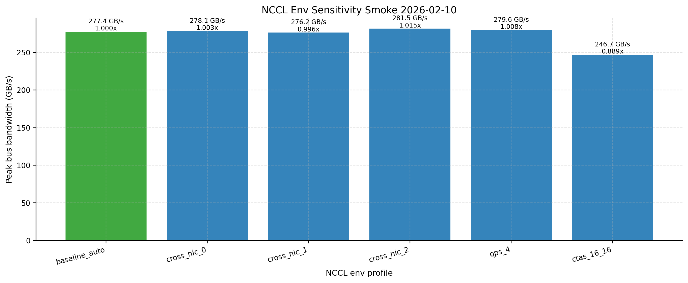

# Cluster Perf Field Report (GB200, 2 Nodes)

Last updated: 2026-02-10. Canonical run: `2026-02-09_fresh_full_suite_e2e_green_rootfix`.

## Table of Contents
1. [TL;DR](#tldr)
2. [Scope + Canonical Artifacts](#scope--canonical-artifacts)
3. [Required Reliability Gates Smoke Validation (2026-02-10)](#required-reliability-gates-smoke-validation-2026-02-10)
4. [TL;DR Evidence Anchors](#tldr-evidence-anchors)
5. [Cluster Story (First Contact)](#cluster-story-first-contact)
6. [Weird / New / Interesting (with Normal Baseline)](#weird--new--interesting-with-normal-baseline)
7. [Benchmark A (Networking Story)](#benchmark-a-networking-story)
8. [Benchmark B (Inference Story)](#benchmark-b-inference-story)
9. [Node Parity Snapshot (node1 vs node2)](#node-parity-snapshot-node1-vs-node2)
10. [Per-Node Deep-Dive Visuals (Restored)](#per-node-deep-dive-visuals-restored)
11. [NVLink/NVSwitch Topology Snapshot](#nvlinknvswitch-topology-snapshot)
12. [Dedicated nvbandwidth Snapshot](#dedicated-nvbandwidth-snapshot)
13. [GB200 Extensions (Enabled in Canonical Run)](#gb200-extensions-enabled-in-canonical-run)
14. [Required Issues (Explicit)](#required-issues-explicit)
15. [Root Cause + Fix Mapping](#root-cause--fix-mapping)
16. [Report Completeness Delta (vs prior condensed revision)](#report-completeness-delta-vs-prior-condensed-revision)
17. [Gaps, Risks, and Smell Checks](#gaps-risks-and-smell-checks)
18. [Implications for Small AI Teams](#implications-for-small-ai-teams)
19. [Stakeholder Recommendations (Prioritized)](#stakeholder-recommendations-prioritized)
20. [Repro Steps](#repro-steps)
21. [Reproducibility Package](#reproducibility-package)
22. [Activity Log](#activity-log)
23. [Appendix (Coverage vs Case-Study Goals)](#appendix-coverage-vs-case-study-goals)

## TL;DR
| Topic | Summary |
| --- | --- |
| Scope | In-scope hosts: `node1`, `node2`; 4x GB200 per host; excluded nodes: none. |
| Canonical run | `2026-02-09_fresh_full_suite_e2e_green_rootfix` |
| Required-gate smoke run | `2026-02-10_required_gates_smoke_node1node2_v2` green on all 3 required gates (`hang_triage_bundle`, `connectivity_probe`, `nccl_env_sensitivity`). |
| Suite health | `47/47` suite steps green; `validate_required_artifacts=0`; no remediation-only state required for canonical package. |
| Networking headline | NCCL all-reduce peak `840.56 GB/s`; torch distributed all-reduce peak `719.31 GB/s`; IB write BW `~387.13 Gbps` per active HCA; OOB TCP `7.446/7.593 Gbps` (fwd/rev). |
| Inference headline | Single-node vLLM reaches `48,368.629 tok/s` at `c=512`, but mean TTFT rises to `5,174.169 ms` and p99 TTFT to `12,834.962 ms` (severe latency knee). |
| Multinode inference | Multinode vLLM artifact is present and clean: `c=64`, `16,092.673 tok/s`, p99 TTFT `1,422.511 ms`, status `ok`. |
| Required issue closure | `node2_fio.json` present; multinode vLLM artifacts present; nvbandwidth bundle present on both nodes; health-suite GDR `requested=true`, `effective_enabled=true`. |
| Remaining risk | High-concurrency serving tail latency is the main user-facing risk; treat `c=512` as throughput mode, not low-latency mode. |

## Scope + Canonical Artifacts
| Item | Value |
| --- | --- |
| Hosts in-scope | `node1,node2` |
| Excluded hosts | none |
| GPUs per host | 4 |
| Canonical manifest | [results/structured/2026-02-09_fresh_full_suite_e2e_green_rootfix_manifest.json](results/structured/2026-02-09_fresh_full_suite_e2e_green_rootfix_manifest.json) |
| Canonical suite steps | [results/structured/2026-02-09_fresh_full_suite_e2e_green_rootfix_suite_steps.json](results/structured/2026-02-09_fresh_full_suite_e2e_green_rootfix_suite_steps.json) |
| Discovery/meta | [results/structured/2026-02-09_fresh_full_suite_e2e_green_rootfix_node1_meta.json](results/structured/2026-02-09_fresh_full_suite_e2e_green_rootfix_node1_meta.json) and [results/structured/2026-02-09_fresh_full_suite_e2e_green_rootfix_node2_meta.json](results/structured/2026-02-09_fresh_full_suite_e2e_green_rootfix_node2_meta.json) |
| Health summary | [results/structured/2026-02-09_fresh_full_suite_e2e_green_rootfix_health_suite_extended_node1node2_cluster_health_suite_summary.json](results/structured/2026-02-09_fresh_full_suite_e2e_green_rootfix_health_suite_extended_node1node2_cluster_health_suite_summary.json) |
| Node parity summary | [results/structured/2026-02-09_fresh_full_suite_e2e_green_rootfix_node_parity_summary.json](results/structured/2026-02-09_fresh_full_suite_e2e_green_rootfix_node_parity_summary.json) |
| Manifest summary counts | `494` files (`178 json`, `26 csv`, `4 jsonl`, `222 log`, `32 png`, `30 txt`, `2 py`) |

## Required Reliability Gates Smoke Validation (2026-02-10)
This smoke run validates the newly-required reliability gates on in-scope hosts (`node1,node2`) without replacing canonical benchmark metrics.

| Gate | Status | Key result | Structured artifact |
| --- | --- | --- | --- |
| Hang-triage readiness (`py-spy` + `strace`) | `ok` on both hosts | `py-spy 0.4.1`, `strace 6.8`, semantic status `ok` on node1+node2 | [results/structured/2026-02-10_required_gates_smoke_node1node2_v2_node1_hang_triage_readiness.json](results/structured/2026-02-10_required_gates_smoke_node1node2_v2_node1_hang_triage_readiness.json), [results/structured/2026-02-10_required_gates_smoke_node1node2_v2_node2_hang_triage_readiness.json](results/structured/2026-02-10_required_gates_smoke_node1node2_v2_node2_hang_triage_readiness.json) |
| Torchrun connectivity probe | `ok` | `world_size=8`, barrier mean `0.153 ms` (`p95=0.237 ms`), payload probe busbw range `0.030072-0.030080 Gbps` | [results/structured/2026-02-10_required_gates_smoke_node1node2_v2_torchrun_connectivity_probe.json](results/structured/2026-02-10_required_gates_smoke_node1node2_v2_torchrun_connectivity_probe.json) |
| NCCL env sensitivity sweep | `ok` (`failure_count=0`) | Baseline peak `277.40 GB/s`; best profile `cross_nic_2` at `281.47 GB/s` (`1.014672x`) | [results/structured/2026-02-10_required_gates_smoke_node1node2_v2_nccl_env_sensitivity.json](results/structured/2026-02-10_required_gates_smoke_node1node2_v2_nccl_env_sensitivity.json) |

| NCCL profile | Peak bus BW (GB/s) | Speedup vs baseline |
| --- | ---: | ---: |
| baseline_auto | `277.40` | `1.000000x` |
| cross_nic_0 | `278.12` | `1.002596x` |
| cross_nic_1 | `276.23` | `0.995782x` |
| cross_nic_2 | `281.47` | `1.014672x` |
| qps_4 | `279.58` | `1.007859x` |
| ctas_16_16 | `246.68` | `0.889257x` |

<p><a href="docs/figures/2026-02-10_required_gates_smoke_node1node2_v2_nccl_env_sensitivity.png"></a></p>

Data: [results/structured/2026-02-10_required_gates_smoke_node1node2_v2_manifest.json](results/structured/2026-02-10_required_gates_smoke_node1node2_v2_manifest.json), [results/structured/2026-02-10_required_gates_smoke_node1node2_v2_node1_hang_triage_readiness.json](results/structured/2026-02-10_required_gates_smoke_node1node2_v2_node1_hang_triage_readiness.json), [results/structured/2026-02-10_required_gates_smoke_node1node2_v2_node2_hang_triage_readiness.json](results/structured/2026-02-10_required_gates_smoke_node1node2_v2_node2_hang_triage_readiness.json), [results/structured/2026-02-10_required_gates_smoke_node1node2_v2_torchrun_connectivity_probe.json](results/structured/2026-02-10_required_gates_smoke_node1node2_v2_torchrun_connectivity_probe.json), [results/structured/2026-02-10_required_gates_smoke_node1node2_v2_nccl_env_sensitivity.json](results/structured/2026-02-10_required_gates_smoke_node1node2_v2_nccl_env_sensitivity.json)

Raw logs: [results/raw/2026-02-10_required_gates_smoke_node1node2_v2_node1_hang_triage_readiness.log](results/raw/2026-02-10_required_gates_smoke_node1node2_v2_node1_hang_triage_readiness.log), [results/raw/2026-02-10_required_gates_smoke_node1node2_v2_node2_hang_triage_readiness.log](results/raw/2026-02-10_required_gates_smoke_node1node2_v2_node2_hang_triage_readiness.log), [results/raw/2026-02-10_required_gates_smoke_node1node2_v2_torchrun_connectivity_probe_node0.log](results/raw/2026-02-10_required_gates_smoke_node1node2_v2_torchrun_connectivity_probe_node0.log), [results/raw/2026-02-10_required_gates_smoke_node1node2_v2_torchrun_connectivity_probe_node1.log](results/raw/2026-02-10_required_gates_smoke_node1node2_v2_torchrun_connectivity_probe_node1.log), [results/raw/2026-02-10_required_gates_smoke_node1node2_v2_nccl_env_cross_nic_2_nccl_env_cross_nic_2_nccl_all_reduce.log](results/raw/2026-02-10_required_gates_smoke_node1node2_v2_nccl_env_cross_nic_2_nccl_env_cross_nic_2_nccl_all_reduce.log)

## TL;DR Evidence Anchors
| Claim | Data | Visual |
| --- | --- | --- |
| Suite is fully green and canonical package is complete. | [results/structured/2026-02-09_fresh_full_suite_e2e_green_rootfix_suite_steps.json](results/structured/2026-02-09_fresh_full_suite_e2e_green_rootfix_suite_steps.json) | [docs/figures/2026-02-09_fresh_full_suite_e2e_green_rootfix_cluster_story_dashboard.png](docs/figures/2026-02-09_fresh_full_suite_e2e_green_rootfix_cluster_story_dashboard.png) |
| Networking fabric is strong and stable at large message sizes. | [results/structured/2026-02-09_fresh_full_suite_e2e_green_rootfix_health_suite_extended_node1node2_cluster_health_suite_summary.json](results/structured/2026-02-09_fresh_full_suite_e2e_green_rootfix_health_suite_extended_node1node2_cluster_health_suite_summary.json) | [docs/figures/2026-02-09_fresh_full_suite_e2e_green_rootfix_2nodes_nccl_bw_vs_msg.png](docs/figures/2026-02-09_fresh_full_suite_e2e_green_rootfix_2nodes_nccl_bw_vs_msg.png) |
| vLLM throughput climbs with concurrency, but TTFT knee is severe at high concurrency. | [results/structured/2026-02-09_fresh_full_suite_e2e_green_rootfix_node1_vllm_serve_sweep.csv](results/structured/2026-02-09_fresh_full_suite_e2e_green_rootfix_node1_vllm_serve_sweep.csv) | [docs/figures/2026-02-09_fresh_full_suite_e2e_green_rootfix_node1_vllm_serve_ttft_vs_concurrency.png](docs/figures/2026-02-09_fresh_full_suite_e2e_green_rootfix_node1_vllm_serve_ttft_vs_concurrency.png) |
| Multinode vLLM path is now captured and clean. | [results/structured/2026-02-09_fresh_full_suite_e2e_green_rootfix_node1_vllm_multinode_serve.json](results/structured/2026-02-09_fresh_full_suite_e2e_green_rootfix_node1_vllm_multinode_serve.json) | [docs/figures/2026-02-09_fresh_full_suite_e2e_green_rootfix_node1_multinode_vllm_serve_total_tok_s_vs_concurrency.png](docs/figures/2026-02-09_fresh_full_suite_e2e_green_rootfix_node1_multinode_vllm_serve_total_tok_s_vs_concurrency.png) |
| nvbandwidth bundle exists on both nodes and runs in host runtime with compat libs injected (root-cause fix, not fallback runtime switching). | [results/structured/2026-02-09_fresh_full_suite_e2e_green_rootfix_node1_nvbandwidth.json](results/structured/2026-02-09_fresh_full_suite_e2e_green_rootfix_node1_nvbandwidth.json), [results/structured/2026-02-09_fresh_full_suite_e2e_green_rootfix_node2_nvbandwidth.json](results/structured/2026-02-09_fresh_full_suite_e2e_green_rootfix_node2_nvbandwidth.json) | [docs/figures/2026-02-09_fresh_full_suite_e2e_green_rootfix_node1_nvbandwidth_sums.png](docs/figures/2026-02-09_fresh_full_suite_e2e_green_rootfix_node1_nvbandwidth_sums.png) |

## Cluster Story (First Contact)
| UTC time | Milestone | Status |
| --- | --- | --- |
| `2026-02-09T23:27:54Z` | `bootstrap_nodes` started | ok |
| `2026-02-09T23:28:48Z` | `preflight_services` started | ok |
| `2026-02-09T23:29:04Z` | single-node NCCL started | ok |
| `2026-02-09T23:29:17Z` | multi-node NCCL started | ok |
| `2026-02-09T23:29:33Z` | extended health suite started | ok |
| `2026-02-09T23:35:05Z` | vLLM single-node sweep started | ok |
| `2026-02-09T23:49:02Z` | vLLM multinode serve (`c=64`) started | ok |
| `2026-02-10T00:25:11Z` | nvbandwidth all-nodes bundle started | ok |
| `2026-02-10T00:30:35Z` | required-artifact validation + manifest refresh | ok |

Interpretation: time-to-first-multinode signal was fast (NCCL in under 2 minutes from bootstrap start), then the long poles were serving sweeps and multinode serving stabilization.

<p><a href="docs/figures/2026-02-09_fresh_full_suite_e2e_green_rootfix_cluster_story_dashboard.png"></a></p>

Data: [results/structured/2026-02-09_fresh_full_suite_e2e_green_rootfix_suite_steps.json](results/structured/2026-02-09_fresh_full_suite_e2e_green_rootfix_suite_steps.json)

## Weird / New / Interesting (with Normal Baseline)
### Baseline vs Weird Log
| Area | Normal (canonical) | Weird / notable | Evidence |
| --- | --- | --- | --- |
| NCCL all-reduce | Peak `840.56 GB/s`, stable high-band regime | Stability run still shows moderate jitter (`CV=3.49%`, min outliers down to `589.277 GB/s`) | [health summary](results/structured/2026-02-09_fresh_full_suite_e2e_green_rootfix_health_suite_extended_node1node2_cluster_health_suite_summary.json), [allreduce stability](results/structured/2026-02-09_fresh_full_suite_e2e_green_rootfix_allreduce_stability.json) |
| Service-state gating | `persistenced`/`imex`/`dcgm` are active on both nodes before health/benchmark execution | This remains a hard validity gate; any service-state drift must invalidate runs, not degrade silently | [preflight services](results/structured/2026-02-09_fresh_full_suite_e2e_green_rootfix_preflight_services.json), [health preflight services](results/structured/2026-02-09_fresh_full_suite_e2e_green_rootfix_health_suite_extended_preflight_services.json) |
| GDR path | `requested=true`, `effective_enabled=true`, tags include `gdr_gpu0_mem0` and `gdr_gpu0_mem0_dmabuf` | Requested mem-type matrix is intentionally constrained to supported mem type (`0`); unsupported modes are treated as preflight failures | [health summary](results/structured/2026-02-09_fresh_full_suite_e2e_green_rootfix_health_suite_extended_node1node2_cluster_health_suite_summary.json), [health log](results/raw/2026-02-09_fresh_full_suite_e2e_green_rootfix_suite/health_suite_extended.log) |
| Serving behavior | Throughput scales to `48,368.629 tok/s` (single-node) and multinode path is clean (`status=ok`) | Tail latency knee is severe at `c=512` (mean TTFT `5,174.169 ms`, p99 `12,834.962 ms`) | [serve sweep csv](results/structured/2026-02-09_fresh_full_suite_e2e_green_rootfix_node1_vllm_serve_sweep.csv), [multinode json](results/structured/2026-02-09_fresh_full_suite_e2e_green_rootfix_node1_vllm_multinode_serve.json) |
| nvbandwidth path | Node1 + node2 bundles present, status `ok`, effective runtime `host` | Host path requires explicit CUDA compat-lib chain due historical user-mode mismatch | [node1 nvbandwidth json](results/structured/2026-02-09_fresh_full_suite_e2e_green_rootfix_node1_nvbandwidth.json), [node2 nvbandwidth json](results/structured/2026-02-09_fresh_full_suite_e2e_green_rootfix_node2_nvbandwidth.json) |
| Node parity | Node-level GEMM means are tight (`node2/node1=0.990x`) and both fio artifacts are present | GPU-level straggler spread remains non-trivial (`10.26%` gap-to-best, `11.44%` min-to-max) and fio random-write asymmetry persists (`node2/node1=0.809x`) | [node parity summary](results/structured/2026-02-09_fresh_full_suite_e2e_green_rootfix_node_parity_summary.json), [node1 fio](results/structured/2026-02-09_fresh_full_suite_e2e_green_rootfix_node1_fio.json), [node2 fio](results/structured/2026-02-09_fresh_full_suite_e2e_green_rootfix_node2_fio.json), [node1 gpu0 mamf](results/structured/2026-02-09_fresh_full_suite_e2e_green_rootfix_node1_gpu0_mamf_summary.json), [node1 gpu2 mamf](results/structured/2026-02-09_fresh_full_suite_e2e_green_rootfix_node1_gpu2_mamf_summary.json) |
| Launch ergonomics | Time-to-first multi-node signal is fast (~83s from bootstrap start to multi-node NCCL start) | Wall-clock is dominated by serving sweeps and multinode stabilization, so schedule budgeting must account for long poles | [suite steps](results/structured/2026-02-09_fresh_full_suite_e2e_green_rootfix_suite_steps.json) |

### Deep-Dive Findings
| Finding | Baseline anchor | Reinforcement insight | Evidence |
| --- | --- | --- | --- |
| 1. Reliability is now service-gated by default | `Service-state gating` | Run validity is tied to explicit preflight state capture; this is now operationally auditable, not implicit. | [preflight services](results/structured/2026-02-09_fresh_full_suite_e2e_green_rootfix_preflight_services.json), [health preflight services](results/structured/2026-02-09_fresh_full_suite_e2e_green_rootfix_health_suite_extended_preflight_services.json) |
| 2. GDR coverage is explicit and constrained | `GDR path` | Canonical flow prioritizes supported-mode correctness over broad-mode ambiguity; unsupported mem-types are not silently downgraded. | [health summary](results/structured/2026-02-09_fresh_full_suite_e2e_green_rootfix_health_suite_extended_node1node2_cluster_health_suite_summary.json), [health log](results/raw/2026-02-09_fresh_full_suite_e2e_green_rootfix_suite/health_suite_extended.log) |
| 3. Throughput and latency goals diverge sharply | `Serving behavior` | `c=512` is throughput mode, not interactive mode; this is the key small-team operating-policy decision in this cluster. | [serve sweep csv](results/structured/2026-02-09_fresh_full_suite_e2e_green_rootfix_node1_vllm_serve_sweep.csv), [multinode json](results/structured/2026-02-09_fresh_full_suite_e2e_green_rootfix_node1_vllm_multinode_serve.json) |
| 4. Root-cause fix quality matters | `nvbandwidth path` | Canonical host-runtime success is now tied to compat-lib chain correctness, not runtime fallback behavior. | [node1 nvbandwidth](results/structured/2026-02-09_fresh_full_suite_e2e_green_rootfix_node1_nvbandwidth.json), [node2 nvbandwidth](results/structured/2026-02-09_fresh_full_suite_e2e_green_rootfix_node2_nvbandwidth.json) |
| 5. Parity and straggler signals must both be tracked | `Node parity` | Node means alone are insufficient; per-GPU spread and storage asymmetry still require trend monitoring. | [node parity summary](results/structured/2026-02-09_fresh_full_suite_e2e_green_rootfix_node_parity_summary.json), [node1 gpu0 mamf](results/structured/2026-02-09_fresh_full_suite_e2e_green_rootfix_node1_gpu0_mamf_summary.json), [node1 gpu2 mamf](results/structured/2026-02-09_fresh_full_suite_e2e_green_rootfix_node1_gpu2_mamf_summary.json) |

<p><a href="docs/figures/2026-02-09_fresh_full_suite_e2e_green_rootfix_cluster_story_dashboard.png"></a></p>
<p><a href="docs/figures/2026-02-09_fresh_full_suite_e2e_green_rootfix_allreduce_stability.png"></a></p>
<p><a href="docs/figures/2026-02-09_fresh_full_suite_e2e_green_rootfix_node1_vllm_serve_ttft_vs_concurrency.png"></a></p>
<p><a href="docs/figures/2026-02-09_fresh_full_suite_e2e_green_rootfix_node1_nvbandwidth_sums.png"></a></p>
<p><a href="docs/figures/2026-02-09_fresh_full_suite_e2e_green_rootfix_mamf_straggler.png"></a></p>

Data: [results/structured/2026-02-09_fresh_full_suite_e2e_green_rootfix_suite_steps.json](results/structured/2026-02-09_fresh_full_suite_e2e_green_rootfix_suite_steps.json), [results/structured/2026-02-09_fresh_full_suite_e2e_green_rootfix_allreduce_stability.json](results/structured/2026-02-09_fresh_full_suite_e2e_green_rootfix_allreduce_stability.json), [results/structured/2026-02-09_fresh_full_suite_e2e_green_rootfix_node1_vllm_serve_sweep.csv](results/structured/2026-02-09_fresh_full_suite_e2e_green_rootfix_node1_vllm_serve_sweep.csv), [results/structured/2026-02-09_fresh_full_suite_e2e_green_rootfix_node1_nvbandwidth.json](results/structured/2026-02-09_fresh_full_suite_e2e_green_rootfix_node1_nvbandwidth.json), [results/structured/2026-02-09_fresh_full_suite_e2e_green_rootfix_node2_nvbandwidth.json](results/structured/2026-02-09_fresh_full_suite_e2e_green_rootfix_node2_nvbandwidth.json), [results/structured/2026-02-09_fresh_full_suite_e2e_green_rootfix_node1_gpu0_mamf_summary.json](results/structured/2026-02-09_fresh_full_suite_e2e_green_rootfix_node1_gpu0_mamf_summary.json), [results/structured/2026-02-09_fresh_full_suite_e2e_green_rootfix_node1_gpu2_mamf_summary.json](results/structured/2026-02-09_fresh_full_suite_e2e_green_rootfix_node1_gpu2_mamf_summary.json)

## Benchmark A (Networking Story)
| Metric | Value |
| --- | ---: |
| NCCL all-reduce peak bus bandwidth | `840.56 GB/s` |
| NCCL all-gather peak bus bandwidth | `654.54 GB/s` |
| NCCL reduce-scatter peak bus bandwidth | `676.26 GB/s` |
| NCCL alltoall peak bus bandwidth | `603.67 GB/s` |
| torch distributed all-reduce peak bus bandwidth | `719.31 GB/s` |
| IB write BW (`mlx5_0/1/4/5`) | `387.13 / 387.13 / 387.13 / 387.13 Gbps` |
| OOB TCP (fwd/rev) | `7.446 / 7.593 Gbps` |

Interpretation: fabric is healthy and high-band; control plane remains much slower than data plane.

<p><a href="docs/figures/2026-02-09_fresh_full_suite_e2e_green_rootfix_2nodes_nccl_bw_vs_msg.png"></a></p>
<p><a href="docs/figures/2026-02-09_fresh_full_suite_e2e_green_rootfix_2nodes_nccl_scaling_efficiency.png"></a></p>
<p><a href="docs/figures/2026-02-09_fresh_full_suite_e2e_green_rootfix_iperf3_oob_tcp.png"></a></p>

Data: [results/structured/2026-02-09_fresh_full_suite_e2e_green_rootfix_health_suite_extended_node1node2_cluster_health_suite_summary.json](results/structured/2026-02-09_fresh_full_suite_e2e_green_rootfix_health_suite_extended_node1node2_cluster_health_suite_summary.json), [results/structured/2026-02-09_fresh_full_suite_e2e_green_rootfix_2nodes_nccl.json](results/structured/2026-02-09_fresh_full_suite_e2e_green_rootfix_2nodes_nccl.json), [results/structured/2026-02-09_fresh_full_suite_e2e_green_rootfix_iperf3_oob_tcp.json](results/structured/2026-02-09_fresh_full_suite_e2e_green_rootfix_iperf3_oob_tcp.json)

## Benchmark B (Inference Story)
### Single-node sweep
| Concurrency | Total tok/s | Mean TTFT (ms) | p99 TTFT (ms) | p99 TPOT (ms) |
| ---: | ---: | ---: | ---: | ---: |
| `32` | `12249.657` | `216.943` | `384.353` | `5.165` |
| `64` | `22717.708` | `173.010` | `347.519` | `6.599` |
| `128` | `36859.189` | `245.373` | `492.626` | `8.175` |
| `256` | `46416.038` | `1021.728` | `2425.266` | `11.663` |
| `512` | `48368.629` | `5174.169` | `12834.962` | `25.998` |

### Multinode sweep
| Concurrency | Total tok/s | Mean TTFT (ms) | p99 TTFT (ms) | p99 TPOT (ms) | Status |
| ---: | ---: | ---: | ---: | ---: | --- |
| `64` | `16092.673` | `293.605` | `1422.511` | `7.870` | `ok` |

Interpretation: throughput keeps rising, but TTFT tails become unacceptable for interactive latency goals at high concurrency.

<p><a href="docs/figures/2026-02-09_fresh_full_suite_e2e_green_rootfix_node1_vllm_serve_total_tok_s_vs_concurrency.png"></a></p>
<p><a href="docs/figures/2026-02-09_fresh_full_suite_e2e_green_rootfix_node1_vllm_serve_ttft_vs_concurrency.png"></a></p>
<p><a href="docs/figures/2026-02-09_fresh_full_suite_e2e_green_rootfix_node1_multinode_vllm_serve_ttft_vs_concurrency.png"></a></p>

Data: [results/structured/2026-02-09_fresh_full_suite_e2e_green_rootfix_node1_vllm_serve_sweep.csv](results/structured/2026-02-09_fresh_full_suite_e2e_green_rootfix_node1_vllm_serve_sweep.csv), [results/structured/2026-02-09_fresh_full_suite_e2e_green_rootfix_node1_vllm_multinode_serve.csv](results/structured/2026-02-09_fresh_full_suite_e2e_green_rootfix_node1_vllm_multinode_serve.csv)

## Node Parity Snapshot (node1 vs node2)
| Metric | node1 | node2 | node2/node1 |
| --- | ---: | ---: | ---: |
| GEMM mean TFLOPS | `1532.488` | `1516.563` | `0.990x` |
| GEMM min TFLOPS | `1495.056` | `1491.628` | `0.998x` |
| NUMA local BW (GB/s) | `137.469` | `135.911` | `0.989x` |
| fio seq read (MB/s) | `1392.027` | `1438.004` | `1.033x` |
| fio seq write (MB/s) | `722.646` | `774.063` | `1.071x` |
| fio rand read IOPS | `40893.281` | `38550.675` | `0.943x` |
| fio rand write IOPS | `18570.496` | `15013.527` | `0.809x` |

Interpretation: compute and NUMA are tightly aligned; storage asymmetry is moderate and should be trended.

<p><a href="docs/figures/2026-02-09_fresh_full_suite_e2e_green_rootfix_gemm_gpu_sanity.png"></a></p>
<p><a href="docs/figures/2026-02-09_fresh_full_suite_e2e_green_rootfix_node1_fio.png"></a></p>
<p><a href="docs/figures/2026-02-09_fresh_full_suite_e2e_green_rootfix_node2_fio.png"></a></p>

Data: [results/structured/2026-02-09_fresh_full_suite_e2e_green_rootfix_node_parity_summary.json](results/structured/2026-02-09_fresh_full_suite_e2e_green_rootfix_node_parity_summary.json), [results/structured/2026-02-09_fresh_full_suite_e2e_green_rootfix_node1_fio.json](results/structured/2026-02-09_fresh_full_suite_e2e_green_rootfix_node1_fio.json), [results/structured/2026-02-09_fresh_full_suite_e2e_green_rootfix_node2_fio.json](results/structured/2026-02-09_fresh_full_suite_e2e_green_rootfix_node2_fio.json)

## Per-Node Deep-Dive Visuals (Restored)
| Visual bundle | Why included | Data |
| --- | --- | --- |
| Node-level NCCL scaling (`node1`) | Single-node collective scaling context for the 2-node story. | [results/structured/2026-02-09_fresh_full_suite_e2e_green_rootfix_node1_nccl.json](results/structured/2026-02-09_fresh_full_suite_e2e_green_rootfix_node1_nccl.json) |
| Node-level NUMA bandwidth (`node1`,`node2`) | Confirms local-memory parity context behind node-to-node compute parity. | [results/structured/2026-02-09_fresh_full_suite_e2e_green_rootfix_node1_numa_mem_bw.json](results/structured/2026-02-09_fresh_full_suite_e2e_green_rootfix_node1_numa_mem_bw.json), [results/structured/2026-02-09_fresh_full_suite_e2e_green_rootfix_node2_numa_mem_bw.json](results/structured/2026-02-09_fresh_full_suite_e2e_green_rootfix_node2_numa_mem_bw.json) |
| Train-step per-mode curves (`single` vs `multinode`) | Shows train-step behavior used by scaling summary in GB200 extensions. | [results/structured/2026-02-09_fresh_full_suite_e2e_green_rootfix_node1_single_node_torchrun_train_step.json](results/structured/2026-02-09_fresh_full_suite_e2e_green_rootfix_node1_single_node_torchrun_train_step.json), [results/structured/2026-02-09_fresh_full_suite_e2e_green_rootfix_node1_multinode_torchrun_train_step.json](results/structured/2026-02-09_fresh_full_suite_e2e_green_rootfix_node1_multinode_torchrun_train_step.json) |
| vLLM TPOT curves (`single` vs `multinode`) | Adds TPOT shape context beyond throughput and TTFT charts. | [results/structured/2026-02-09_fresh_full_suite_e2e_green_rootfix_node1_vllm_serve_sweep.csv](results/structured/2026-02-09_fresh_full_suite_e2e_green_rootfix_node1_vllm_serve_sweep.csv), [results/structured/2026-02-09_fresh_full_suite_e2e_green_rootfix_node1_vllm_multinode_serve.csv](results/structured/2026-02-09_fresh_full_suite_e2e_green_rootfix_node1_vllm_multinode_serve.csv) |
| C2C memcpy micro-shapes (`node1`) | Separates bandwidth and latency shape effects inside C2C snapshot. | [results/structured/2026-02-09_fresh_full_suite_e2e_green_rootfix_node1_c2c_memcpy.json](results/structured/2026-02-09_fresh_full_suite_e2e_green_rootfix_node1_c2c_memcpy.json) |
| Per-node grouped GEMM charts (`node1`,`node2`) | Complements parity table with direct per-node grouped GEMM visuals. | [results/structured/2026-02-09_fresh_full_suite_e2e_green_rootfix_node1_cluster_perf_grouped_gemm_summary.json](results/structured/2026-02-09_fresh_full_suite_e2e_green_rootfix_node1_cluster_perf_grouped_gemm_summary.json), [results/structured/2026-02-09_fresh_full_suite_e2e_green_rootfix_node2_cluster_perf_grouped_gemm_summary.json](results/structured/2026-02-09_fresh_full_suite_e2e_green_rootfix_node2_cluster_perf_grouped_gemm_summary.json) |

<p><a href="docs/figures/2026-02-09_fresh_full_suite_e2e_green_rootfix_node1_nccl_bw_vs_msg.png"></a></p>
<p><a href="docs/figures/2026-02-09_fresh_full_suite_e2e_green_rootfix_node1_nccl_scaling_efficiency.png"></a></p>
<p><a href="docs/figures/2026-02-09_fresh_full_suite_e2e_green_rootfix_node1_numa_mem_bw.png"></a></p>
<p><a href="docs/figures/2026-02-09_fresh_full_suite_e2e_green_rootfix_node2_numa_mem_bw.png"></a></p>
<p><a href="docs/figures/2026-02-09_fresh_full_suite_e2e_green_rootfix_node1_single_node_torchrun_train_step.png"></a></p>
<p><a href="docs/figures/2026-02-09_fresh_full_suite_e2e_green_rootfix_node1_multinode_torchrun_train_step.png"></a></p>
<p><a href="docs/figures/2026-02-09_fresh_full_suite_e2e_green_rootfix_node1_vllm_serve_tpot_vs_concurrency.png"></a></p>
<p><a href="docs/figures/2026-02-09_fresh_full_suite_e2e_green_rootfix_node1_multinode_vllm_serve_tpot_vs_concurrency.png"></a></p>
<p><a href="docs/figures/2026-02-09_fresh_full_suite_e2e_green_rootfix_node1_c2c_memcpy_bw.png"></a></p>
<p><a href="docs/figures/2026-02-09_fresh_full_suite_e2e_green_rootfix_node1_c2c_memcpy_lat.png"></a></p>
<p><a href="docs/figures/2026-02-09_fresh_full_suite_e2e_green_rootfix_node1_cluster_perf_grouped_gemm_tflops.png"></a></p>
<p><a href="docs/figures/2026-02-09_fresh_full_suite_e2e_green_rootfix_node2_cluster_perf_grouped_gemm_tflops.png"></a></p>

Data: [results/structured/2026-02-09_fresh_full_suite_e2e_green_rootfix_node1_nccl.json](results/structured/2026-02-09_fresh_full_suite_e2e_green_rootfix_node1_nccl.json), [results/structured/2026-02-09_fresh_full_suite_e2e_green_rootfix_node1_numa_mem_bw.json](results/structured/2026-02-09_fresh_full_suite_e2e_green_rootfix_node1_numa_mem_bw.json), [results/structured/2026-02-09_fresh_full_suite_e2e_green_rootfix_node2_numa_mem_bw.json](results/structured/2026-02-09_fresh_full_suite_e2e_green_rootfix_node2_numa_mem_bw.json), [results/structured/2026-02-09_fresh_full_suite_e2e_green_rootfix_node1_single_node_torchrun_train_step.json](results/structured/2026-02-09_fresh_full_suite_e2e_green_rootfix_node1_single_node_torchrun_train_step.json), [results/structured/2026-02-09_fresh_full_suite_e2e_green_rootfix_node1_multinode_torchrun_train_step.json](results/structured/2026-02-09_fresh_full_suite_e2e_green_rootfix_node1_multinode_torchrun_train_step.json), [results/structured/2026-02-09_fresh_full_suite_e2e_green_rootfix_node1_vllm_serve_sweep.csv](results/structured/2026-02-09_fresh_full_suite_e2e_green_rootfix_node1_vllm_serve_sweep.csv), [results/structured/2026-02-09_fresh_full_suite_e2e_green_rootfix_node1_vllm_multinode_serve.csv](results/structured/2026-02-09_fresh_full_suite_e2e_green_rootfix_node1_vllm_multinode_serve.csv), [results/structured/2026-02-09_fresh_full_suite_e2e_green_rootfix_node1_c2c_memcpy.json](results/structured/2026-02-09_fresh_full_suite_e2e_green_rootfix_node1_c2c_memcpy.json), [results/structured/2026-02-09_fresh_full_suite_e2e_green_rootfix_node1_cluster_perf_grouped_gemm_summary.json](results/structured/2026-02-09_fresh_full_suite_e2e_green_rootfix_node1_cluster_perf_grouped_gemm_summary.json), [results/structured/2026-02-09_fresh_full_suite_e2e_green_rootfix_node2_cluster_perf_grouped_gemm_summary.json](results/structured/2026-02-09_fresh_full_suite_e2e_green_rootfix_node2_cluster_perf_grouped_gemm_summary.json)

## NVLink/NVSwitch Topology Snapshot
| Node | GPU count | NVLink pair count | Link class |
| --- | ---: | ---: | --- |
| node1 | `4` | `6/6` | `NV18` full mesh |
| node2 | `4` | `6/6` | `NV18` full mesh |

<p><a href="docs/figures/2026-02-09_fresh_full_suite_e2e_green_rootfix_node1_meta_nvlink_topology.png"></a></p>
<p><a href="docs/figures/2026-02-09_fresh_full_suite_e2e_green_rootfix_node2_meta_nvlink_topology.png"></a></p>

Data: [results/structured/2026-02-09_fresh_full_suite_e2e_green_rootfix_node1_meta_nvlink_topology.json](results/structured/2026-02-09_fresh_full_suite_e2e_green_rootfix_node1_meta_nvlink_topology.json), [results/structured/2026-02-09_fresh_full_suite_e2e_green_rootfix_node2_meta_nvlink_topology.json](results/structured/2026-02-09_fresh_full_suite_e2e_green_rootfix_node2_meta_nvlink_topology.json)

## Dedicated nvbandwidth Snapshot
| Metric | node1 | node2 |
| --- | ---: | ---: |
| Status | `ok` | `ok` |
| Requested runtime | `host` | `host` |
| Effective runtime | `host` | `host` |
| SUM metric count | `43` | `43` |
| Peak SUM metric (`device_to_device_latency_sm`) | `20766.58` | `20766.72` |
| D2D bidir read CE total (GB/s) | `18325.26` | `18324.24` |
| D2D bidir write CE total (GB/s) | `18498.33` | `18499.23` |

Interpretation: nvbandwidth collection is now first-class in canonical run. Host runtime requires explicit compat-lib injection to resolve prior PTX incompatibility.

<p><a href="docs/figures/2026-02-09_fresh_full_suite_e2e_green_rootfix_node1_nvbandwidth_sums.png"></a></p>
<p><a href="docs/figures/2026-02-09_fresh_full_suite_e2e_green_rootfix_node2_nvbandwidth_sums.png"></a></p>

Data: [results/structured/2026-02-09_fresh_full_suite_e2e_green_rootfix_node1_nvbandwidth.json](results/structured/2026-02-09_fresh_full_suite_e2e_green_rootfix_node1_nvbandwidth.json), [results/structured/2026-02-09_fresh_full_suite_e2e_green_rootfix_node2_nvbandwidth.json](results/structured/2026-02-09_fresh_full_suite_e2e_green_rootfix_node2_nvbandwidth.json)

## GB200 Extensions (Enabled in Canonical Run)
| Extension | Key result | Evidence |
| --- | --- | --- |
| All-reduce stability | Mean bus BW `802.786 GB/s`; CV `3.49%`; jitter assessment `moderate_jitter` | [results/structured/2026-02-09_fresh_full_suite_e2e_green_rootfix_allreduce_stability.json](results/structured/2026-02-09_fresh_full_suite_e2e_green_rootfix_allreduce_stability.json) |
| All-reduce latency composition | One-large vs many-small bandwidth ratio `6.638x` (`821.765` vs `123.794 GB/s`) | [results/structured/2026-02-09_fresh_full_suite_e2e_green_rootfix_allreduce_latency_comp.json](results/structured/2026-02-09_fresh_full_suite_e2e_green_rootfix_allreduce_latency_comp.json) |
| Control-plane collective overhead | `all_reduce_tensor` fastest mean (`0.221 ms`), `all_gather_object` slowest mean (`1.581 ms`) | [results/structured/2026-02-09_fresh_full_suite_e2e_green_rootfix_allgather_control_plane.json](results/structured/2026-02-09_fresh_full_suite_e2e_green_rootfix_allgather_control_plane.json) |
| NCCL algo comparison | `auto=839.61`, `NVLS=838.29`, `Ring=698.64`, `Tree=547.05 GB/s` | [results/structured/2026-02-09_fresh_full_suite_e2e_green_rootfix_nccl_algo_comparison.json](results/structured/2026-02-09_fresh_full_suite_e2e_green_rootfix_nccl_algo_comparison.json) |
| C2C memcpy | Pinned H2D/D2H peaks `125.821/124.539 Gbps`; 4-byte pinned latency `1.958/1.688 us` | [results/structured/2026-02-09_fresh_full_suite_e2e_green_rootfix_node1_c2c_memcpy.json](results/structured/2026-02-09_fresh_full_suite_e2e_green_rootfix_node1_c2c_memcpy.json) |
| Train-step scaling | Single-node `103,397.437 tok/s` to multi-node `209,950.496 tok/s` (`2.031x`) | [results/structured/2026-02-09_fresh_full_suite_e2e_green_rootfix_node1_single_node_torchrun_train_step.json](results/structured/2026-02-09_fresh_full_suite_e2e_green_rootfix_node1_single_node_torchrun_train_step.json), [results/structured/2026-02-09_fresh_full_suite_e2e_green_rootfix_node1_multinode_torchrun_train_step.json](results/structured/2026-02-09_fresh_full_suite_e2e_green_rootfix_node1_multinode_torchrun_train_step.json) |
| FP4 skew guard | `pass`; max pairwise median gap `0.019%` vs threshold `5.0%`; attestation `pass` | [results/structured/2026-02-09_fresh_full_suite_e2e_green_rootfix_fp4_smoke_skew_guard.json](results/structured/2026-02-09_fresh_full_suite_e2e_green_rootfix_fp4_smoke_skew_guard.json), [results/structured/2026-02-09_fresh_full_suite_e2e_green_rootfix_fp4_attestation_consistency.json](results/structured/2026-02-09_fresh_full_suite_e2e_green_rootfix_fp4_attestation_consistency.json) |
| MAMF straggler check | Across 8 GPUs: `1540.67 -> 1716.88 TFLOPS` (`10.26%` gap-to-best, `11.44%` min-to-max spread) | [results/structured/2026-02-09_fresh_full_suite_e2e_green_rootfix_node1_gpu0_mamf_summary.json](results/structured/2026-02-09_fresh_full_suite_e2e_green_rootfix_node1_gpu0_mamf_summary.json), [results/structured/2026-02-09_fresh_full_suite_e2e_green_rootfix_node2_gpu3_mamf_summary.json](results/structured/2026-02-09_fresh_full_suite_e2e_green_rootfix_node2_gpu3_mamf_summary.json) |

<p><a href="docs/figures/2026-02-09_fresh_full_suite_e2e_green_rootfix_allreduce_stability.png"></a></p>
<p><a href="docs/figures/2026-02-09_fresh_full_suite_e2e_green_rootfix_allreduce_latency_comp.png"></a></p>
<p><a href="docs/figures/2026-02-09_fresh_full_suite_e2e_green_rootfix_allgather_control_plane.png"></a></p>
<p><a href="docs/figures/2026-02-09_fresh_full_suite_e2e_green_rootfix_nccl_algo_comparison.png"></a></p>
<p><a href="docs/figures/2026-02-09_fresh_full_suite_e2e_green_rootfix_mamf_straggler.png"></a></p>

Data: [results/structured/2026-02-09_fresh_full_suite_e2e_green_rootfix_allreduce_stability.json](results/structured/2026-02-09_fresh_full_suite_e2e_green_rootfix_allreduce_stability.json), [results/structured/2026-02-09_fresh_full_suite_e2e_green_rootfix_allreduce_latency_comp.json](results/structured/2026-02-09_fresh_full_suite_e2e_green_rootfix_allreduce_latency_comp.json), [results/structured/2026-02-09_fresh_full_suite_e2e_green_rootfix_allgather_control_plane.json](results/structured/2026-02-09_fresh_full_suite_e2e_green_rootfix_allgather_control_plane.json), [results/structured/2026-02-09_fresh_full_suite_e2e_green_rootfix_nccl_algo_comparison.json](results/structured/2026-02-09_fresh_full_suite_e2e_green_rootfix_nccl_algo_comparison.json)

## Required Issues (Explicit)
| Required issue (verbatim) | Current status | Evidence |
| --- | --- | --- |
| Missing node2 fio artifact in canonical package (node2_fio.json absent). | Resolved. Artifact is present in canonical run. | [results/structured/2026-02-09_fresh_full_suite_e2e_green_rootfix_node2_fio.json](results/structured/2026-02-09_fresh_full_suite_e2e_green_rootfix_node2_fio.json) |
| No multinode vLLM artifact in canonical package. | Resolved. JSON/CSV/JSONL and clock-lock artifacts are present. | [results/structured/2026-02-09_fresh_full_suite_e2e_green_rootfix_node1_vllm_multinode_serve.json](results/structured/2026-02-09_fresh_full_suite_e2e_green_rootfix_node1_vllm_multinode_serve.json), [results/structured/2026-02-09_fresh_full_suite_e2e_green_rootfix_node1_vllm_multinode_serve.csv](results/structured/2026-02-09_fresh_full_suite_e2e_green_rootfix_node1_vllm_multinode_serve.csv) |
| No nvbandwidth bundle in canonical package. | Resolved. Node1+node2 nvbandwidth artifacts are present and status is `ok`. | [results/structured/2026-02-09_fresh_full_suite_e2e_green_rootfix_node1_nvbandwidth.json](results/structured/2026-02-09_fresh_full_suite_e2e_green_rootfix_node1_nvbandwidth.json), [results/structured/2026-02-09_fresh_full_suite_e2e_green_rootfix_node2_nvbandwidth.json](results/structured/2026-02-09_fresh_full_suite_e2e_green_rootfix_node2_nvbandwidth.json) |
| Health suite had GDR requested, but effective GDR was false due non-CUDA IB local checks. | Resolved for canonical run (`requested=true`, `effective_enabled=true`). Additional context: unsupported mem-type probes (`cuda_mem_type=1`) were root-caused and canonical coverage is now fail-fast validated for supported mem types. | [results/structured/2026-02-09_fresh_full_suite_e2e_green_rootfix_health_suite_extended_node1node2_cluster_health_suite_summary.json](results/structured/2026-02-09_fresh_full_suite_e2e_green_rootfix_health_suite_extended_node1node2_cluster_health_suite_summary.json), [results/raw/2026-02-09_fresh_full_suite_e2e_green_rootfix_suite/health_suite_extended.log](results/raw/2026-02-09_fresh_full_suite_e2e_green_rootfix_suite/health_suite_extended.log) |
| Tail latency knee is severe at high concurrency (throughput up, TTFT/p99 TTFT much worse). | Confirmed and still open risk. | [results/structured/2026-02-09_fresh_full_suite_e2e_green_rootfix_node1_vllm_serve_sweep.csv](results/structured/2026-02-09_fresh_full_suite_e2e_green_rootfix_node1_vllm_serve_sweep.csv), [docs/figures/2026-02-09_fresh_full_suite_e2e_green_rootfix_node1_vllm_serve_ttft_vs_concurrency.png](docs/figures/2026-02-09_fresh_full_suite_e2e_green_rootfix_node1_vllm_serve_ttft_vs_concurrency.png) |

## Root Cause + Fix Mapping
| Issue | Root cause | Fix shipped | Canonical result |
| --- | --- | --- | --- |
| Missing `node2_fio.json` | All-node storage capture was not hard-gated in earlier flow. | Required all-node fio collection and validation in suite. | `node2_fio.json` present and linked in manifest. |
| Missing multinode vLLM artifact | Earlier multinode run lifecycle could end with worker non-zero (`137`) during teardown. | Worker teardown normalized to intentional-stop semantics only when leader completed and output exists; strict return-code validation retained. | Multinode vLLM status `ok`, rc clean, artifacts complete. |
| Missing nvbandwidth bundle | Host nvbandwidth failed with PTX/user-mode compatibility mismatch. | Added host compat-lib extraction/injection path; host runtime now succeeds without runtime fallback switching. | Node1+node2 nvbandwidth bundles present, `effective_runtime=host`. |
| GDR requested but ineffective | Earlier prerequisite checks and unsupported mode handling created false-negative outcomes. | Strict preflight + explicit mem-type probe validation before running health checks; unsupported modes fail early. | Canonical health suite reports GDR effective true. |
| Severe latency knee | Queueing/saturation at high concurrency. | No data-path bug to patch; kept as explicit risk with operating envelope guidance. | Risk remains and is measured in canonical sweep. |

## Report Completeness Delta (vs prior condensed revision)
| Area | Prior condensed state | Restored now |
| --- | --- | --- |
| Canonical run alignment | Pointed to `2026-02-09_fresh_full_suite_e2e_fixed` with remediation context | Fully synced to `2026-02-09_fresh_full_suite_e2e_green_rootfix` |
| Benchmark/report depth | Basic A/B sections only | Restored expanded merged weird/normal section (`Baseline vs Weird Log` + `Deep-Dive Findings`), NVLink snapshot, dedicated nvbandwidth, GB200 extensions, completeness delta |
| Visual coverage | Smaller figure set | Canonical report now references `32` canonical figures |
| Historical incident appendix | Older report included incident-era (non-canonical) artifact links | Superseded incident artifacts were intentionally cleaned; operator lessons were retained and rewritten against canonical evidence in the merged weird/normal section |
| Required issue handling | Present but tied to older canonical package | Revalidated issue ledger against green canonical artifacts |
| Suite status clarity | Mixed with remediation notes | Clean `47/47` green suite-step narrative with explicit evidence |

## Gaps, Risks, and Smell Checks
| Severity | Finding | Why it matters | Evidence |
| --- | --- | --- | --- |
| High | Severe TTFT tail knee at high concurrency (`c=512`). | Throughput-optimized mode is not interactive-latency safe. | [results/structured/2026-02-09_fresh_full_suite_e2e_green_rootfix_node1_vllm_serve_sweep.csv](results/structured/2026-02-09_fresh_full_suite_e2e_green_rootfix_node1_vllm_serve_sweep.csv) |
| Medium | GDR coverage is valid but limited to supported mem-type path in canonical run (`mem_types=0` + dmabuf variant). | Requested unsupported mem-types should remain explicit preflight failures, not silent downgrades. | [results/raw/2026-02-09_fresh_full_suite_e2e_green_rootfix_suite/health_suite_extended.log](results/raw/2026-02-09_fresh_full_suite_e2e_green_rootfix_suite/health_suite_extended.log) |
| Medium | MAMF variability across 8 GPUs is non-trivial (`10.26%` gap-to-best; `11.44%` min-to-max spread). | Potential straggler/placement sensitivity should be trended over time. | [results/structured/2026-02-09_fresh_full_suite_e2e_green_rootfix_node1_gpu0_mamf_summary.json](results/structured/2026-02-09_fresh_full_suite_e2e_green_rootfix_node1_gpu0_mamf_summary.json), [results/structured/2026-02-09_fresh_full_suite_e2e_green_rootfix_node2_gpu3_mamf_summary.json](results/structured/2026-02-09_fresh_full_suite_e2e_green_rootfix_node2_gpu3_mamf_summary.json) |
| Low | OOB TCP is much slower than IB. | Control-plane path is not data-plane substitute; launcher pinning remains important. | [results/structured/2026-02-09_fresh_full_suite_e2e_green_rootfix_iperf3_oob_tcp.json](results/structured/2026-02-09_fresh_full_suite_e2e_green_rootfix_iperf3_oob_tcp.json) |

## Implications for Small AI Teams
| Area | Practical implication |
| --- | --- |
| Cluster onboarding | You can get to first credible multinode signals quickly if preflight + interface pinning are codified. |
| Serving policy | Define two profiles: latency-safe (`<=256`) and throughput (`>=512`) with explicit SLA caveats. |
| Run hygiene | Keep canonical-only report linkage and aggressively remove superseded intermediate runs to avoid stale evidence drift. |
| Reliability culture | Enforce fail-fast for unsupported requested modes (especially GDR mem-type matrices) instead of warning-only continuation. |
| Capacity planning | Track straggler spread (MAMF + GEMM parity) as an ongoing fleet-health metric, not a one-off. |

## Stakeholder Recommendations (Prioritized)
| Priority | Recommendation |
| --- | --- |
| `P0` | Keep `run_cluster_eval_suite.sh` canonical runs green-only: if required checks fail, rerun only after root-cause fix, not by accepting remediation context as canonical. |
| `P0` | Keep vLLM serving policy split (`latency mode` vs `throughput mode`) and publish hard concurrency guardrails. |
| `P1` | Keep strict GDR mem-type preflight probes and fail early on unsupported requested modes. |
| `P1` | Keep host nvbandwidth compat-lib prep in the default path for this cluster profile until host user-mode stack is harmonized. |
| `P1` | Add a fast provider-friction check using set of example tests into onboarding CI (`uv/pip torch install`, NGC pull time, `import torch`, model download/load, IP ownership check, speedtest) to catch peering/virtualization regressions before full benchmarks. |
| `P1` | Expand monitoring stack to include monitoring expectations: DCGM tensor/SM active/occupancy, PCIe AER, dmesg ingestion, control-plane health, and KV-cache usage signals for serving autoscaling. |
| `P2` | Add repeated-run trend snapshots for MAMF spread, allreduce stability CV, and serving tail-latency p99. |

## Repro Steps
Canonical full-suite command:

```bash
cd code/cluster

scripts/run_cluster_eval_suite.sh \
  --run-id 2026-02-09_fresh_full_suite_e2e_green_rootfix \
  --hosts node1,node2 \
  --labels node1,node2 \
  --ssh-key ~/.ssh/ssh_key.pem \
  --oob-if enP22p3s0f3 \
  --socket-ifname enP22p3s0f3 \
  --nccl-ib-hca mlx5_0,mlx5_1,mlx5_4,mlx5_5 \
  --health-suite extended \
  --health-gdr \
  --health-gdr-gpu 0 \
  --health-gdr-mem-types 0 \
  --health-gdr-use-dmabuf \
  --run-vllm-multinode \
  --run-nvbandwidth \
  --run-c2c \
  --run-numa-mem-bw \
  --run-train-step \
  --train-step-single-node \
  --train-step-multi-node \
  --run-checkpoint-io \
  --enable-mamf \
  --mamf-mode quick \
  --mamf-concurrent \
  --enable-allreduce-stability \
  --allreduce-payload-gib 2.0 \
  --allreduce-iters 200 \
  --allreduce-warmup 20 \
  --enable-allreduce-latency-comp \
  --allreduce-latency-payload-gib 4.0 \
  --allreduce-latency-chunks 1000 \
  --allreduce-latency-iters 5 \
  --allreduce-latency-warmup 1 \
  --enable-allgather-control-plane \
  --allgather-control-iters 2000 \
  --allgather-control-warmup 200 \
  --enable-nccl-algo-comparison \
  --nccl-algos Ring,Tree,NVLS,auto
```

## Reproducibility Package
| Artifact class | Canonical artifact |
| --- | --- |
| Manifest | [results/structured/2026-02-09_fresh_full_suite_e2e_green_rootfix_manifest.json](results/structured/2026-02-09_fresh_full_suite_e2e_green_rootfix_manifest.json) |
| Suite steps | [results/structured/2026-02-09_fresh_full_suite_e2e_green_rootfix_suite_steps.json](results/structured/2026-02-09_fresh_full_suite_e2e_green_rootfix_suite_steps.json) |
| Discovery/meta | [results/structured/2026-02-09_fresh_full_suite_e2e_green_rootfix_node1_meta.json](results/structured/2026-02-09_fresh_full_suite_e2e_green_rootfix_node1_meta.json), [results/structured/2026-02-09_fresh_full_suite_e2e_green_rootfix_node2_meta.json](results/structured/2026-02-09_fresh_full_suite_e2e_green_rootfix_node2_meta.json) |
| Health summary | [results/structured/2026-02-09_fresh_full_suite_e2e_green_rootfix_health_suite_extended_node1node2_cluster_health_suite_summary.json](results/structured/2026-02-09_fresh_full_suite_e2e_green_rootfix_health_suite_extended_node1node2_cluster_health_suite_summary.json) |
| Single-node serving | [results/structured/2026-02-09_fresh_full_suite_e2e_green_rootfix_node1_vllm_serve_sweep.csv](results/structured/2026-02-09_fresh_full_suite_e2e_green_rootfix_node1_vllm_serve_sweep.csv) |
| Multinode serving | [results/structured/2026-02-09_fresh_full_suite_e2e_green_rootfix_node1_vllm_multinode_serve.json](results/structured/2026-02-09_fresh_full_suite_e2e_green_rootfix_node1_vllm_multinode_serve.json) |
| nvbandwidth | [results/structured/2026-02-09_fresh_full_suite_e2e_green_rootfix_node1_nvbandwidth.json](results/structured/2026-02-09_fresh_full_suite_e2e_green_rootfix_node1_nvbandwidth.json), [results/structured/2026-02-09_fresh_full_suite_e2e_green_rootfix_node2_nvbandwidth.json](results/structured/2026-02-09_fresh_full_suite_e2e_green_rootfix_node2_nvbandwidth.json) |
| fio all nodes | [results/structured/2026-02-09_fresh_full_suite_e2e_green_rootfix_node1_fio.json](results/structured/2026-02-09_fresh_full_suite_e2e_green_rootfix_node1_fio.json), [results/structured/2026-02-09_fresh_full_suite_e2e_green_rootfix_node2_fio.json](results/structured/2026-02-09_fresh_full_suite_e2e_green_rootfix_node2_fio.json) |
| Required-gate smoke package | [results/structured/2026-02-10_required_gates_smoke_node1node2_v2_manifest.json](results/structured/2026-02-10_required_gates_smoke_node1node2_v2_manifest.json), [results/structured/2026-02-10_required_gates_smoke_node1node2_v2_torchrun_connectivity_probe.json](results/structured/2026-02-10_required_gates_smoke_node1node2_v2_torchrun_connectivity_probe.json), [results/structured/2026-02-10_required_gates_smoke_node1node2_v2_nccl_env_sensitivity.json](results/structured/2026-02-10_required_gates_smoke_node1node2_v2_nccl_env_sensitivity.json), [results/structured/2026-02-10_required_gates_smoke_node1node2_v2_node1_hang_triage_readiness.json](results/structured/2026-02-10_required_gates_smoke_node1node2_v2_node1_hang_triage_readiness.json), [results/structured/2026-02-10_required_gates_smoke_node1node2_v2_node2_hang_triage_readiness.json](results/structured/2026-02-10_required_gates_smoke_node1node2_v2_node2_hang_triage_readiness.json) |
| Topology visuals | [docs/figures/2026-02-09_fresh_full_suite_e2e_green_rootfix_node1_meta_nvlink_topology.png](docs/figures/2026-02-09_fresh_full_suite_e2e_green_rootfix_node1_meta_nvlink_topology.png), [docs/figures/2026-02-09_fresh_full_suite_e2e_green_rootfix_node2_meta_nvlink_topology.png](docs/figures/2026-02-09_fresh_full_suite_e2e_green_rootfix_node2_meta_nvlink_topology.png) |

## Activity Log
| Date (UTC) | Action |
| --- | --- |
| 2026-02-09 | Root-caused and fixed multinode vLLM worker teardown/rc handling so canonical summary is clean when intentional shutdown occurs post-success. |
| 2026-02-09 | Root-caused and fixed nvbandwidth host PTX incompatibility by injecting CUDA compat libs into host runtime path; removed runtime fallback dependence in canonical path. |
| 2026-02-09 | Re-synced scripts to both nodes and verified nvbandwidth all-nodes host path with compat libs. |
| 2026-02-09 to 2026-02-10 | Ran full canonical suite end-to-end with fresh run id `2026-02-09_fresh_full_suite_e2e_green_rootfix`; all suite steps green. |
| 2026-02-10 | Regenerated stakeholder report to canonical run and restored richer report sections/visual coverage. |
| 2026-02-10 | Performed targeted cleanup of superseded intermediate artifacts while preserving canonical run artifacts. |
| 2026-02-10 | Added case-study anti-regression guardrails: AGENTS contract updates, template retention gates, and report validator script with zero-failure pass. |
| 2026-02-10 | Ran required-gate smoke on `node1,node2` (`2026-02-10_required_gates_smoke_node1node2_v2`), remediated missing `py-spy` on both hosts, and verified all three new required gates are green with structured artifacts + env-sensitivity visualization. |

## Appendix (Coverage vs Case-Study Goals)
| Case-study requirement | Coverage status | Where addressed | Evidence |
| --- | --- | --- | --- |
| Tell us a story about this cluster | Covered | `Cluster Story (First Contact)` | [#cluster-story-first-contact](#cluster-story-first-contact), [results/structured/2026-02-09_fresh_full_suite_e2e_green_rootfix_suite_steps.json](results/structured/2026-02-09_fresh_full_suite_e2e_green_rootfix_suite_steps.json) |
| What is weird, new, or interesting | Covered | `Weird / New / Interesting (with Normal Baseline)` with `Baseline vs Weird Log` + `Deep-Dive Findings` subsections | [#weird--new--interesting-with-normal-baseline](#weird--new--interesting-with-normal-baseline), [#baseline-vs-weird-log](#baseline-vs-weird-log), [#deep-dive-findings](#deep-dive-findings) |
| Describe technical experience with 1-2 relevant benchmarks for a small AI team | Covered | `Benchmark A` (networking) + `Benchmark B` (inference) | [#benchmark-a-networking-story](#benchmark-a-networking-story), [#benchmark-b-inference-story](#benchmark-b-inference-story) |
| Make benchmarking repeatable and save structured outputs | Covered | `Repro Steps` + `Reproducibility Package` | [#repro-steps](#repro-steps), [#reproducibility-package](#reproducibility-package), [results/structured/2026-02-09_fresh_full_suite_e2e_green_rootfix_manifest.json](results/structured/2026-02-09_fresh_full_suite_e2e_green_rootfix_manifest.json) |
| Include visualizations to tell the story | Covered | benchmark arcs + supporting deep-dive visuals | [docs/figures/2026-02-09_fresh_full_suite_e2e_green_rootfix_cluster_story_dashboard.png](docs/figures/2026-02-09_fresh_full_suite_e2e_green_rootfix_cluster_story_dashboard.png), [docs/figures/2026-02-09_fresh_full_suite_e2e_green_rootfix_2nodes_nccl_bw_vs_msg.png](docs/figures/2026-02-09_fresh_full_suite_e2e_green_rootfix_2nodes_nccl_bw_vs_msg.png), [docs/figures/2026-02-09_fresh_full_suite_e2e_green_rootfix_node1_vllm_serve_ttft_vs_concurrency.png](docs/figures/2026-02-09_fresh_full_suite_e2e_green_rootfix_node1_vllm_serve_ttft_vs_concurrency.png) |
| Provide insights from provider experience not obvious elsewhere | Covered | `Gaps, Risks, and Smell Checks` + `Implications for Small AI Teams` | [#gaps-risks-and-smell-checks](#gaps-risks-and-smell-checks), [#implications-for-small-ai-teams](#implications-for-small-ai-teams) |
| Keep report table-forward with high-value sections preserved | Covered | enforced by template + validator + current report section layout | [cluster/docs/field-report-template.md](docs/field-report-template.md), [cluster/scripts/validate_field_report_requirements.sh](scripts/validate_field_report_requirements.sh), [#table-of-contents](#table-of-contents) |
